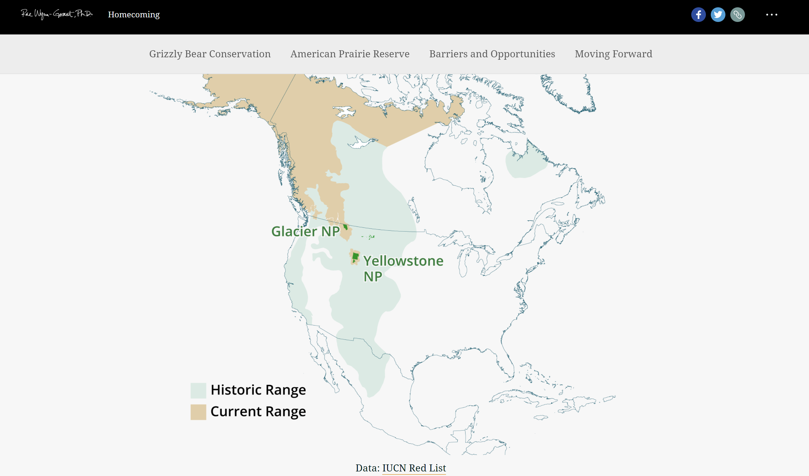
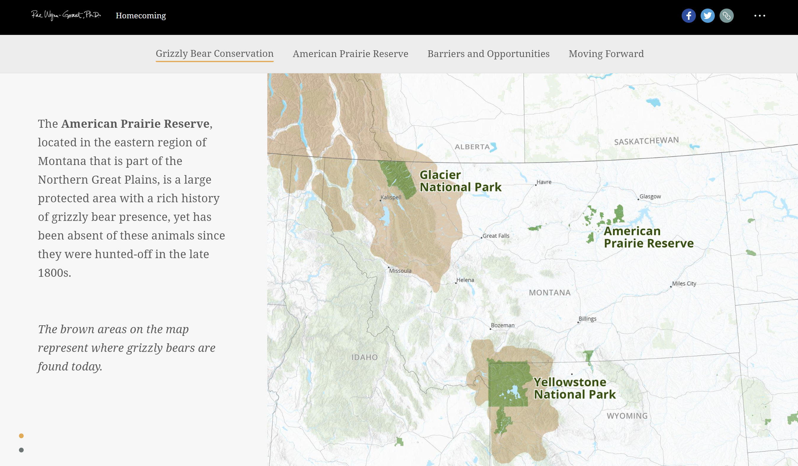
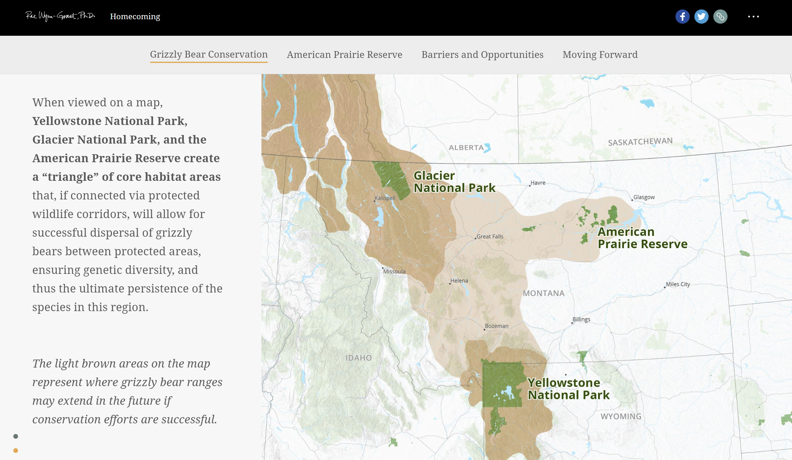
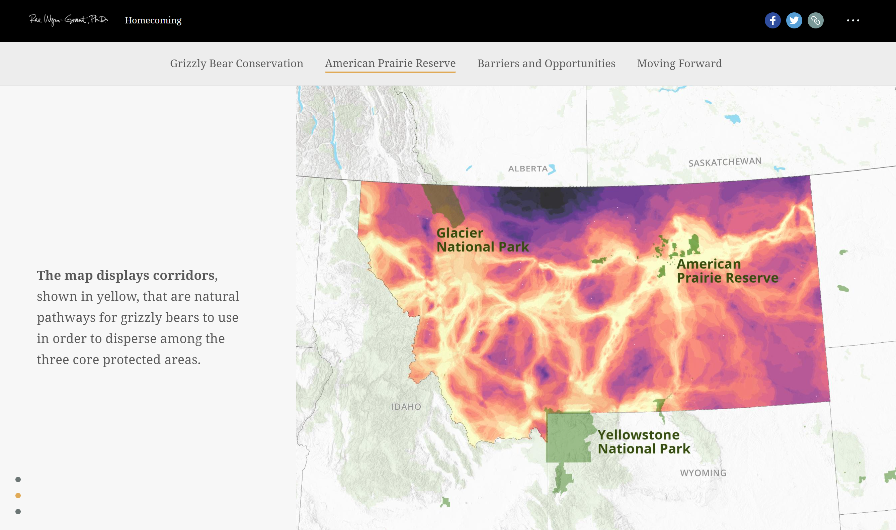
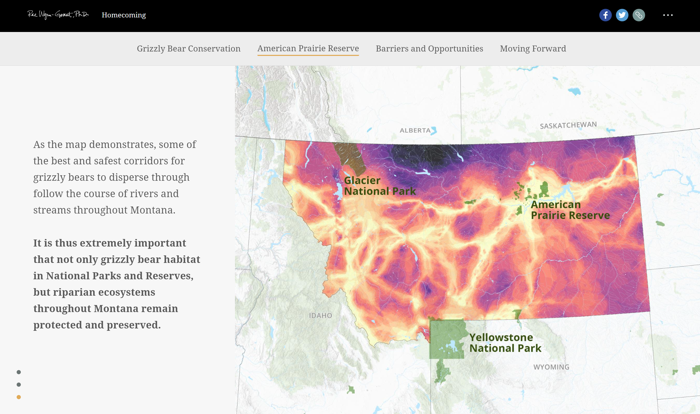

# Grizzly Bear StoryMap Essay
### Chase Verbout
#### UW GEOG 458
[Link to StoryMap](https://storymaps.arcgis.com/stories/5478d43c857c4d30887423fa84414ef8)

To start, I want you to think about a bear. Now the question is: what kind of bear did you think of? There’s a variety of bear species throughout the world but I’m willing to wager that it was large and brown; the makings of a grizzly bear. Being from the Pacific North West, this comes as no surprise since this is an area they tend to roam. Or maybe you just read the title and saw the image below - oh well. Anyways, Dr. Rae Wynn-Grant, a large carnivore ecologist, has put together an ArcGIS StoryMap discussing the grizzly bear’s travel patterns in the American Prairie Reserve. The following essay will be a critique of her work beginning by introducing the story, then addressing the systematic architecture and web mapping design, and finishing with a reflection on the project’s pros, cons, and connections to our Geography 458: Advanced Geographies course material.

## Introduction

*Homecoming: How grizzly bears can find safe passage to their home ranges in the American Prairie Reserve (APR)*. Dr. Wynn-Grant finds great passion in “exploring human-carnivore coexistence” to which she found that this study was able to fulfil that motif. The purpose behind creating this geonarative comes down to the always worsening impact of humans on nature. She states, “today the journey of these bears from protected areas in the West to the APR landscape in the East poses many unique challenges that they have not evolved to properly understand.” So, in order to develop a better understanding and work towards educating others, she has utilized field-tools/data collection and esri mapping technology to demonstrate the travel patterns of the grizzly bear through the APR.

In total, she has implemented 3 maps with which we are able look at/interact with. The first map is a simple depiction of historic and present grizzly bear presence. There is a clear indication from this map that over time, the range within which grizzly bears have lived has diminished greatly. The layers on the map are permanent with the current range overlaying the historic range. The map also includes both Glacier National Park and Yellowstone National park; both noted grizzly bear habitats. Outside of the legend for the layers, there are no other web map features such as a scalar bar or north arrow. The listed data source for this map is IUCN Red List, a website that details the extinction levels of species. The second map is a zoomed in look centered around Southern Canada, Montana, Idaho, and Wyoming. Here, we can see a light brown overlay that if you read the text will know that indicates the current range of grizzly bears like the first map. Both Yellowstone and Glacier are labeled once again with the addition of the American Prairie reserve. They are denoted by their darker green color. There is an interactive aspect to this map as you can scroll down a little bit and a new brown overlay will be placed on the map. Now, the lighter brown represents *“where grizzly bear ranges may extend in the future if conservation efforts are successful”* with the new darker brown signifying the current range. There are no web map features like a legend, scalar bar, or north arrow outside of the park labels. The third map “displays corridors, shown in yellow, that are natural pathways for grizzly bears to use in order to disperse among the three core protected areas”. Dr. Wynn-Grant notes that she utilized Esri’s mapping tools to build this connectivity model. The map is an overlay of Montana using a yellow to purple gradual color scale and includes the previous national parks. It is also interactive. Allowing the user to scroll down and add in water sources. If you read the text paragraphs to the side you will see this is because it seems they are related to the paths best suited for the grizzly bears. Again, there are no web map features to discuss outside of labels.

Map 1           						|
:-------------------------:|
  			|

There is not a direct call out as to who this geonarrative is for but we can infer based on its hosting service and material. Being on ArcGIS WebStory is accessible to really anyone and the level of material is quite introductory/exploratory so it would seem to me that it is for everyone. I think it stands to inform the unknowing and as a call to action in hopes of popularizing the issue at hand. Dr. Rae Wynn-Grant herself received an M.S. in Environmental Studies from Yale and PhD in Ecology and Evolution from Columbia. She is also a known fellow research fellow with the National Geographic Society. Most of the work done in this geonarrative is her own with the exception of the photography to which she credits Carolyn Barnwell, Uryadnikov Sergey, Patrick, Kerry Snelson and Tsalani Lassiter. As for data sources, Other than IUCN Red List, there is no indication of when it was collected or where from. I think we can assume that Dr. Wynn-Grant has used her own collected data for a good portion of it due to her long history of working within the APR and with bears. Her credentials are very aligned with this project and lead me to trust her work.

## Systematic Architecture

Moving on to an analysis of systematic architecture in place. Upon inspection of the webmap through developer tools in the browser, none of the maps are being created through a hosting service. Instead, they are images of the maps that have been previously created. The geonarrative itself however, is being hosted on ArcGIS so we can assume that they are operating as a web service in this case. Most likely handling data storage as well as server management. Almost all of the content is preloaded and then added into the body of the html document with a script to determine how the scrolling will operate with the images. The only major operating functions are related to holding one image in a fixed place while continuing to move text down creating a feeling of interactivity as the map changes slightly(an almost identical image takes the place of the one that was just there). The scripting for this seems to be done with specific ArcGIS js files which makes sense since this is a key feature of Arc website. They would want it all to be done with similar functions so why not develop your own required scripts.

 ##  UI/UX and Web Mapping design

Next, we look at the overall web mapping design and the UI/UX that come with it. Because this is being hosted by ArcGIS StoryMaps there is a level of professionalism that innately comes with it. They have a structure within which you are expected to design your personalized experience. For the most part, the geonarrative does adhere to responsive web design. However, when the screen size on a monitor is decreased the map images are altered differently than all of the other images. They become too small and prevent the user from really seeing them. This is due to their fixed positioning in the full screen to make it look as though only one part of the screen is scrolling. Apart from this, everything else adapts the size of the screen likely using auto margins and a max/min-width function. The basemap being used for both “interactive” maps is the ESRI Topographic base layer which I was able to figure out on my own by traversing the basemaps in QGIS. As stated earlier on, there are a couple of thematic layers being used: the historic range of grizzly bears, the current range of grizzly bears, the potential range of grizzly bears, and potential paths of travel for grizzly bears. Additionally, National Parks in the area of study are emphasized. As for interactivity, the maps give the user the ability to scroll up and down to remove or add these thematic layers. Although, really they are just two different maps being swapped.

Map 2A           						|  Map 2B
:-------------------------:|:-------------------------:
  			|  

## Pros and Cons

### Pros

Now, I will assess my view of the features provided by establishing several pros and cons for this work. To begin, let's look at the positives - I really appreciated the smoothness to moving about this project. The transitions are seamless as you move down the page and create a great illusion of interactivity in the presented maps. On top of this, the text used is complementary to the images and not the driving force. Small paragraphs work symbiotically with the photographs and maps to keep you engaged. There is never a point where the text gets overwhelming in length keeping the viewer engaged. The use of bold text in paragraphs even further simplifies the process for the reader giving them the key points as they go along. The maps themselves are sized appropriately making it easy to see what is going on and being presented. The color schemes in the maps do not conflict however I have nothing further to say in this section about them. Unfortunately, most of the cons are centered in this area.

### Cons

For starters, map one is the only map to use a legend. I would have liked to see this map either use the same faux interactivity as the other two (scroll to show a new layer) or be truly interactive (click boxes). It seems we are to assume that the historic range is included in all of the current range however we can not know this for sure hence my point about interactivity. This map does not include a scalar bar or a north arrow but this is consistent with all of the maps. It could definitely use some supplemental web map features. Map 2, while explaining the colors in the text on the side needs to have a legend. Not only that but as you scroll the meaning for the coloring actually changes. I think it would have been best to maintain the same meaning for the color while making the new color take on the new value. This map also needs supplemental web map features. Map 3, the most complex of the bunch as it uses esri geoprocessing tools, even more than the last needs a legend. Using a gradual color scale, we have no idea what they represent other than being told in the text that yellow indicates the paths. Once more, there are no web map features and there really ought to be but I digress. All of my cons lie in the map design but that is not to say they aren’t adequate. They get the job done, but I think there is a lot left that could have been done.

Map 3A           						|  Map 3B
:-------------------------:|:-------------------------:
  			|  

## Reflection

Reflecting on the material from GEOG 458 this quarter I couldn’t help but think about the concept of affective geovisualization. In Affective GeoVisualizations, Stuart Aitkin and James Craine make a case for the evolution of visualization in the GIS industry. That is, for too long we have have been using the same principles to create maps and to believe that just because the current status is what it is does not mean we should stop looking forward to new and innovative methods of presentation. In their article, they ask us to think back to a series of maps we found ourselves lost in going further to describe the experience as *“...pouring over the image to the extent that we may lose a conscious connection to our corporeality. The space between our conscious knowledge of our bodies and the borders of the map merge. Perhaps time disappears. We are lost to the task of imagining what it would be like to be in this place for the first time. We imagine tramping over the hills or along the streets depicted in the map...”*. I can’t say I felt anything close to that as I went through the geovisualizations of this project. To which, I truly understood what they were after when they wrote this article. We should not treat visualizations as a corporation would produce a product (mass produced and low quality), but as an artist would treat their painting. I don’t say this to disparage the geonarrative I am critiquing but to emphasize the need to adapt with time and technology. We have the capability to create innovative pieces of media that convey the same information as a light grey base map and a choropleth layer; it is really a matter of giving something new a chance.
